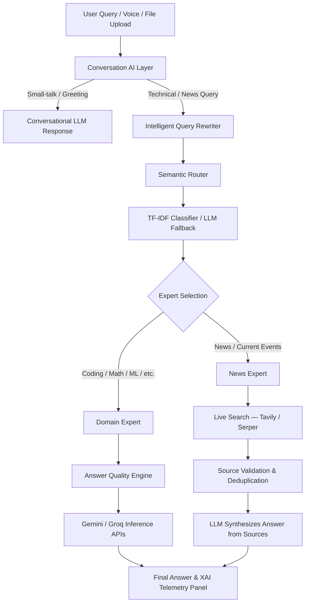

# IntelliMoE — Multi-Expert AI Assistant

[](https://github.com/suresh4330/IntelliMoE)
[](https://www.python.org/)
[](https://streamlit.io/)
[](https://ai.google.dev/)
[](https://groq.com/)
[](https://tavily.com/)
[](https://github.com/suresh4330/IntelliMoE)

IntelliMoE is a premium, production-grade **Mixture of Experts (MoE) AI assistant** with live web search, semantic routing, a conversational AI layer, an intelligent query rewriter, and a ChatGPT-style UI. It dynamically routes user prompts to specialized LLM experts, retrieves real-time information through trusted news sources, evaluates outputs with an Answer Quality Engine, and presents full diagnostic explainability metrics.

> **Repository:** [https://github.com/suresh4330/IntelliMoE.git](https://github.com/suresh4330/IntelliMoE.git)

---

## Table of Contents
1. [Overview](#overview)
2. [Feature Highlights](#feature-highlights)
3. [What's New](#whats-new)
4. [Resume Highlights](#resume-highlights)
5. [Screenshots](#screenshots)
6. [Tech Stack](#tech-stack)
7. [Architecture](#architecture)
8. [How It Works](#how-it-works)
9. [Project Structure](#project-structure)
10. [Expert Reference](#expert-reference)
11. [Environment Variables](#environment-variables)
12. [Run Locally](#run-locally)
13. [Run with Docker & Compose](#run-with-docker--compose)
14. [Troubleshooting](#troubleshooting)
15. [FAQ](#faq)
16. [Contributing](#contributing)
17. [Changelog](#changelog)
18. [Roadmap](#roadmap)
19. [Author](#author)
20. [License](#license)

---

## Overview

IntelliMoE helps developers, researchers, students, and general users solve complex queries by dispatching them to specialized AI agents. Questions about today's cricket match, the latest news, coding problems, math equations, or research papers are all handled by dedicated domain experts — not a single generalist model.

Every answer passes through a multi-stage Answer Quality Engine (plan → draft → review → improve), while a live XAI diagnostics panel shows exactly how and why a particular expert was chosen.

---

## Feature Highlights

### 🧠 Core Intelligence
- **Semantic MoE Routing**: Dynamically routes queries to specialized experts using a hybrid Semantic Router (sentence embeddings + cosine similarity) + TF-IDF classifier + LLM fallback.
- **Conversation AI Layer**: Detects purely conversational intents (greetings, small-talk, follow-ups) and handles them directly via LLM without invoking the router pipeline.
- **Answer Quality Engine (AQE)**: Multi-stage response refinement — `ResponsePlanner` → `ResponseReviewer` → `ResponseImprover` — ensuring only the highest-quality outputs are displayed.

### 📰 Live News Expert (NEW)
- **Real-Time Web Search**: Retrieves live information using **Tavily API** (primary) and **Serper API** (fallback) — the LLM never answers current-events questions from memory.
- **Intelligent Query Rewriter**: Converts broken English, mixed-language, and informal queries into clean, optimized search queries before fetching results (e.g., `"todayy odi match win"` → `"Who won today's ODI cricket match?"`).
- **Multi-Source Aggregation**: Merges results from 5–10 trusted sources (ESPN Cricinfo, BBC, Reuters, TechCrunch, Bloomberg, etc.), removes duplicates, and flags conflicting reports.
- **Source Validation**: Filters spam, low-quality sites, and duplicate titles before generating the final answer.
- **Graceful Failure Handling**: If search fails or no reliable info is found, returns a clear user-friendly message instead of hallucinating.

### 🔍 Explainable AI (XAI)
- Diagnostic developer panels showing routing decisions, expert selection, query rewriter input/output, search provider used, article sources retrieved, plan traces, review criteria, latency benchmarks, and raw JSON schemas.

### 🎙️ Voice & Input
- **Voice Typing**: Browser Web Speech API integration with active recording indicator `🔴` and auto-submission.
- **Text-to-Speech**: Auto-reads responses aloud when a query is dictated.
- **ChatGPT-Style Input Bar**: Unified pill container with a circular `+` upload button on the left, textarea in the center, mic icon and purple send button on the right.

### 📁 File Attachments & RAG
- **ChatGPT-Style `+` Upload**: Click `+` inside the chat bar to open the file picker — attachment chips (`📄 filename ✕`) appear inside the input container.
- **RAG Pipeline**: ChromaDB + SentenceTransformers for semantic search over research papers.

### 💾 Persistence & Profiles
- **MongoDB Atlas** (primary) with automatic **local JSON fallback** for reliable cross-session chat history.
- Multi-thread chat sessions per user profile saved and reloaded seamlessly.

### 📊 Evaluation & Benchmarking
- Automated metric collection, historical run logs, accuracy/latency diagnostics, and pytest coverage.

### 🐳 Docker Support
- Production-ready `Dockerfile` and `docker-compose.yml` for containerized execution.

---

## What's New

### v2.0.0 — Live Search, Semantic Router, Query Rewriter, ChatGPT UI

| Phase | Feature | Description |
|-------|---------|-------------|
| **38** | Live Search News Expert | Tavily + Serper dual-provider search, source deduplication, spam filtering |
| **38** | Abstract Search Interface | `BaseSearchProvider` pattern — add new providers without modifying News Expert |
| **39** | Intelligent Query Rewriter | Cleans broken English, fixes spelling, expands abbreviations before search |
| **39** | News XAI Telemetry | Rewriter latency, original/rewritten query, provider used, article cards in XAI panel |
| **40** | Semantic Router | Sentence-embedding cosine similarity router with LRU cache |
| **40** | Conversation AI Layer | Detects greetings & small-talk; never misroutes `"Hi, latest AI news"` to conversational handler |
| **41** | ChatGPT-Style Input | Circular `+` button, attachment chips, mic on right — existing design preserved |
| **—** | MongoDB + Local Fallback | `utils/db.py` — Atlas primary, auto-falls back to local JSON on SSL/network errors |
| **—** | OpenAI Client | `services/openai_client.py` — optional OpenAI with graceful quota/fallback handling |

---

## Resume Highlights

- **Built a production-grade Mixture of Experts (MoE) AI assistant** powered by Gemini and Groq APIs with live real-time web search via Tavily and Serper.
- **Designed a multi-layer routing architecture**: Semantic Router (sentence embeddings) → TF-IDF Intent Classifier → LLM fallback, dynamically routing 10+ domain experts.
- **Implemented an Intelligent Query Rewriter** that normalizes broken English, spelling errors, and informal queries into clean search terms before hitting live search APIs.
- **Built a Live News Expert** that retrieves, deduplicates, and synthesizes information from 5–10 trusted news sources — the LLM never fabricates current-event answers.
- **Developed an Answer Quality Engine** (plan → draft → review → improve) improving response quality by auditing correctness, completeness, and formatting.
- **Implemented Conversation AI Layer** to intercept small-talk and greetings at the front of the pipeline, preventing unnecessary expert routing.
- **Integrated MongoDB Atlas with automatic local JSON fallback** ensuring zero data loss even when cloud connectivity fails.
- **Redesigned the chat UI** with a ChatGPT-style integrated input bar featuring a circular `+` upload button, attachment chips, and Web Speech API voice typing.
- **Configured Docker containerization** with Docker Compose for volume-mounted hot-reload development environments.

### Resume-ready one-liner:
> Developed a production-grade Mixture of Experts (MoE) AI assistant with a semantic routing layer, live web search (Tavily/Serper), an intelligent query rewriter, a multi-stage Answer Quality Engine, MongoDB-backed persistence, and a ChatGPT-style voice/upload input UI.

---

## Screenshots

### Voice Dictation (Active Listening)


### Response Generated


### Text-to-Speech (Speaking State)


### ChatGPT-Style Input with + Upload Button


---

## Tech Stack

### Frontend
- HTML5 / CSS3 (Custom Dark Mode Layouts)
- Streamlit (Framework UI)
- JavaScript (Web Speech API, DOM injection for custom input controls)

### Backend / Core
- Python 3.10+
- Groq SDK & Google GenAI (Gemini) API
- OpenAI API (optional, graceful fallback)
- Streamlit Session State Management

### Live Search
- **Tavily API** — primary real-time search provider
- **Serper API** — fallback search provider
- Abstract `BaseSearchProvider` interface for extensibility

### Machine Learning & Routing
- `sentence-transformers` (`all-MiniLM-L6-v2`) — semantic embeddings
- `scikit-learn` (TF-IDF Intent Classifier)
- Cosine similarity-based Semantic Router with LRU cache

### RAG & Vector Store
- ChromaDB (Vector Store)
- SentenceTransformers embeddings

### Persistence
- MongoDB Atlas (primary)
- Local JSON fallback (`data/chat_history_{user}.json`)

### DevOps & Testing
- Docker & Docker Compose
- pytest test suite

---

## Architecture



### System Dataflow
```
                User Input
                    │
                    ▼
        ┌─────────────────────┐
        │  Conversation AI     │
        │  Layer               │
        └──────────┬──────────┘
                   │
          ┌────────┴────────┐
          ▼                 ▼
   Conversational      Technical / News
   LLM Response             │
                            ▼
                  Query Rewriter
                  (cleans broken English)
                            │
                            ▼
                   Semantic Router
                   (embeddings + cosine)
                            │
                            ▼
                  TF-IDF Classifier
                  (LLM fallback)
                            │
              ┌─────────────┴──────────────┐
              ▼                            ▼
         News Expert               Domain Expert
              │                    (Coding/Math/ML…)
              ▼                            │
     Live Search (Tavily/Serper)           ▼
     Source Validation              Answer Quality Engine
     Deduplication                  (Plan→Draft→Review→Improve)
              │                            │
              └─────────────┬──────────────┘
                            ▼
                   Gemini / Groq APIs
                            │
                            ▼
               Final Answer + XAI Panel + TTS
```

---

## How It Works

### Live Search & News Expert
1. User asks a current-events question (e.g., *"today's ODI cricket result"*).
2. **Conversation AI Layer** detects it is not small-talk and passes to the router.
3. **Query Rewriter** rewrites it to `"Who won today's ODI cricket match?"`.
4. **News Expert** calls Tavily (primary) → Serper (fallback).
5. Results are deduplicated, spam-filtered, and validated against trusted domain lists.
6. The LLM synthesizes a final answer **only** from retrieved sources — never from memory.
7. Source cards, rewriter telemetry, and search latency are shown in the XAI panel.

### Answer Quality Engine
Expert prompt selected → LLM generates a structural plan → Draft generated → Reviewer audits correctness/completeness/formatting → Improver patches weaknesses → Output returned.

### Semantic Router
Query is embedded using `all-MiniLM-L6-v2` → cosine similarity scored against all expert profiles → highest-similarity expert selected (with LRU cache for repeated queries).

### Voice Typing Pipeline
Mic click → Web Speech API initialized on parent page context → Transcript inserted into textarea → React state bypass via raw HTML prototype value setter → Auto-submit triggered.

---

## Project Structure

```
IntelliMoE/
├── app.py                      # Entry point
├── config/                     # Configuration & settings
├── conversation_ai/            # Conversation AI layer (detector, layer, responder)
├── experts/                    # Domain expert LLM wrappers
│   ├── news.py                 # Live Search News Expert
│   ├── coding.py
│   ├── math.py
│   ├── ml.py
│   ├── deeplearning.py
│   ├── research.py
│   ├── system_design.py
│   ├── genai.py
│   └── vision.py
├── news/
│   └── query_rewriter.py       # Intelligent Query Rewriter
├── semantic_router/            # Semantic routing layer
│   ├── semantic_router.py
│   ├── expert_profiles.py
│   ├── similarity.py
│   └── cache.py
├── router/                     # MoE routing engine & AQE
│   ├── router.py
│   ├── orchestrator.py
│   ├── quality_engine.py
│   └── ...
├── services/                   # API client connectors
│   ├── search_client.py        # Tavily + Serper search providers
│   ├── gemini_client.py
│   ├── groq_client.py
│   └── openai_client.py
├── explainability/             # XAI diagnostics & telemetry
├── prompts/                    # Expert prompt templates
│   └── news.txt                # News Expert prompt
├── ui/
│   └── app.py                  # Streamlit frontend (ChatGPT-style UI)
├── utils/
│   ├── db.py                   # MongoDB + local JSON fallback
│   ├── memory.py               # Conversation memory
│   ├── vector_store.py         # ChromaDB RAG
│   └── ...
├── tests/                      # pytest test suite
│   ├── test_news.py
│   ├── test_query_rewriter.py
│   ├── test_semantic_router.py
│   └── ...
├── data/                       # Evaluation DB, vectorizer, papers
├── docs/screenshots/           # UI screenshots
├── Dockerfile
├── docker-compose.yml
└── requirements.txt
```

---

## Expert Reference

| Expert | Handles |
|--------|---------|
| `NewsExpert` | Current events, sports results, politics, technology news — via live search |
| `CodingExpert` | Programming, scripting, debugging |
| `MLExpert` | Machine learning algorithms, model training |
| `MathExpert` | Equations, algebra, statistics |
| `DeepLearningExpert` | Neural networks, transformers, weights |
| `ResearchExpert` | Academic papers, RAG-augmented context |
| `SystemDesignExpert` | Distributed systems, high availability |
| `GenAIExpert` | LLM orchestration, prompt engineering |
| `VisionExpert` | Image understanding, multimodal queries |
| `ConversationalAI` | Greetings, small-talk, general knowledge |

---

## Environment Variables

Create a `.env` file in the project root:

```env
# Required
GEMINI_API_KEY=your_gemini_api_key
GROQ_API_KEY=your_groq_api_key

# Live Search (at least one required for News Expert)
TAVILY_API_KEY=your_tavily_api_key
SERPER_API_KEY=your_serper_api_key

# Optional — OpenAI (gracefully falls back to Gemini/Groq if quota exceeded)
OPENAI_API_KEY=your_openai_api_key

# Optional — MongoDB Atlas (falls back to local JSON if not set or connection fails)
MONGODB_URI=your_mongodb_atlas_connection_string
```

> **Note:** If `MONGODB_URI` is not set or connection fails, chat history automatically falls back to local JSON storage in `data/`.

---

## Run Locally

### 1. Clone the Repository
```bash
git clone https://github.com/suresh4330/IntelliMoE.git
cd IntelliMoE
```

### 2. Configure Environment
```bash
cp .env.example .env
# Edit .env and fill in your API keys
```

### 3. Install Dependencies
```bash
pip install -r requirements.txt
```

### 4. Launch App
```bash
streamlit run app.py
```
Open [http://localhost:8501](http://localhost:8501) in your browser.

---

## Run with Docker & Compose

### 1. Configure Environment
Make sure `.env` is created with your credentials.

### 2. Build and Start Container
```bash
docker compose up --build -d
```

### 3. Access App
Once the build completes, open **[http://localhost:8501](http://localhost:8501)**.

### 4. Stop
```bash
docker compose down
```

---

## Troubleshooting

### News Expert returns no results
Verify `TAVILY_API_KEY` and `SERPER_API_KEY` are correctly set in `.env`. The system will try Tavily first, then Serper. If both fail, it returns a graceful error message.

### ChromaDB SQLite locks
If the app locks on initialization, delete `data/chroma_db/` to let the RAG auto-seeder recreate it cleanly.

### Microphone not recording
Speech recognition requires a secure context (`https://` or `localhost`). Verify browser permissions allow audio input.

### MongoDB connection errors
SSL/network errors are automatically handled — the app falls back to local JSON storage. Check your Atlas cluster's network access whitelist if you need cloud persistence.

### Docker Registry / DNS issues
If Docker fails to download base images, add `8.8.8.8` to your Docker daemon DNS settings.

---

## FAQ

### Why use a Query Rewriter?
Raw user queries are often informal, misspelled, or in broken English. Searching these directly yields poor results. The Query Rewriter normalizes the query first, ensuring the search engine returns relevant articles.

### Why does the News Expert never use LLM memory?
Current-event knowledge is time-sensitive and frequently inaccurate in LLM training data. By always retrieving live sources, IntelliMoE guarantees factual, up-to-date answers.

### Why use both Tavily and Serper?
Tavily provides higher-quality, AI-optimized results. Serper is the fallback for reliability. The abstract `BaseSearchProvider` interface allows adding more providers in future without modifying the News Expert.

### Can I run this offline?
Yes — all domain experts (coding, math, ML, etc.) work fully offline with Gemini/Groq APIs. Only the News Expert requires internet access.

---

## Contributing
Contributions are welcome. Please open an issue or pull request to discuss improvements before making large changes.

---

## Changelog

| Version | Changes |
|---------|---------|
| **v2.0.0** | Live Search News Expert, Intelligent Query Rewriter, Semantic Router, Conversation AI Layer, MongoDB persistence, ChatGPT-style input, OpenAI client |
| **v1.5.0** | Automated multi-expert benchmarking, diagnostic profiling, and evaluation logging suite |
| **v1.4.0** | Docker containerization & Docker Compose with volume mounting for hot-reloads |
| **v1.3.0** | User profile management and persistent multi-thread JSON chat history |
| **v1.2.0** | Answer Quality Engine, Voice Dictation, Text-to-Speech playback |
| **v1.1.0** | ChromaDB RAG Research pipeline |
| **v1.0.0** | Initial release — Hybrid Router & 7 Specialized Experts |

---

## Roadmap
- [ ] Streaming response support (token-by-token output)
- [ ] Multi-modal vision input (image + question)
- [ ] Kubernetes orchestration manifests
- [ ] Local inference fallback via Ollama / Llama.cpp
- [ ] Additional search providers (Bing, DuckDuckGo)

---

## Author
**Suresh Annamneedi**
- Email: annamneedisuresh003@gmail.com
- GitHub: [@suresh4330](https://github.com/suresh4330)

---

## License
This project is intended for educational and academic use.
