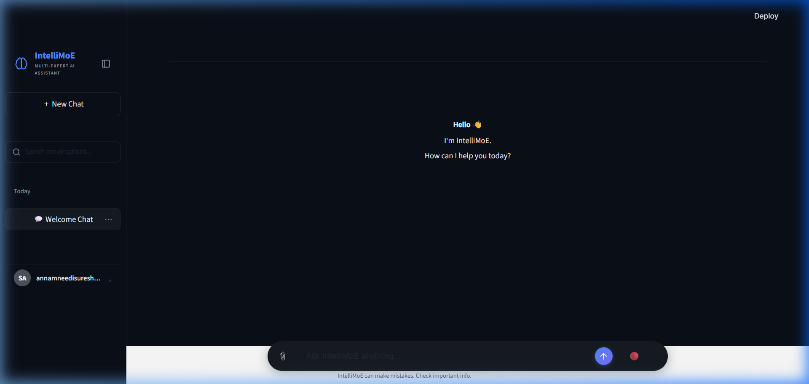
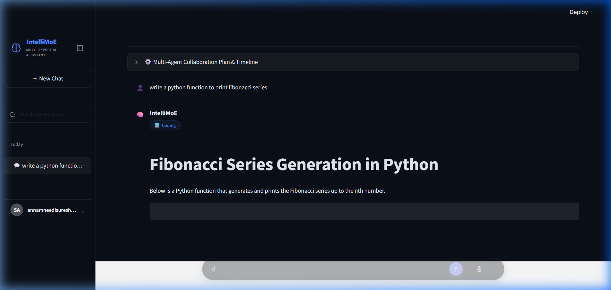
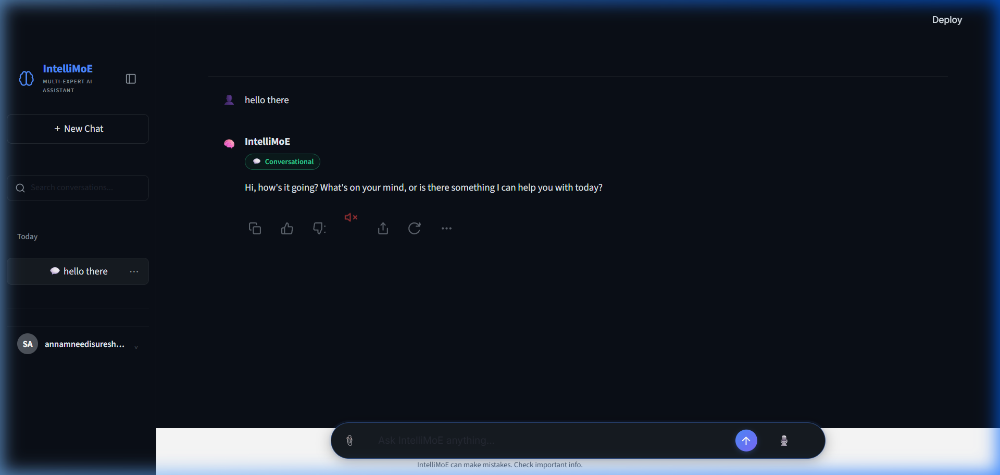
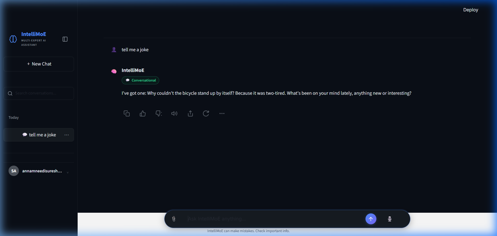

# IntelliMoE — Multi-Expert AI Assistant

[](https://github.com/suresh4330/IntelliMoE)
[](https://www.python.org/)
[](https://streamlit.io/)
[](https://github.com/suresh4330/IntelliMoE)

IntelliMoE is a premium, multi-expert AI assistant built on a Mixture of Experts (MoE) routing engine. It dynamically routes user prompts to specialized LLM experts (Coding, ML, Math, Deep Learning, Research, System Design, GenAI) based on semantic classification, evaluates the output with an Answer Quality Engine (planning, review, improvement), and presents diagnostic explainability metrics in a dark-themed UI.

Repository: [https://github.com/suresh4330/IntelliMoE.git](https://github.com/suresh4330/IntelliMoE.git)

---

## Table of Contents
1. [Overview](#overview)
2. [Feature Highlights](#feature-highlights)
3. [Resume Highlights](#resume-highlights)
4. [Screenshots](#screenshots)
5. [Tech Stack](#tech-stack)
6. [Architecture](#architecture)
7. [How It Works](#how-it-works)
8. [Project Structure](#project-structure)
9. [Core References](#core-references)
10. [Run Locally](#run-locally)
11. [Troubleshooting](#troubleshooting)
12. [FAQ](#faq)
13. [Contributing](#contributing)
14. [Changelog](#changelog)
15. [Roadmap](#roadmap)
16. [Author](#author)
17. [License](#license)

---

## Overview
IntelliMoE helps developers, researchers, and students solve complex technical queries by dynamically dispatching questions to highly tuned specialized agents. By wrapping LLM answers inside a multi-stage review pipeline (Answer Quality Engine) and logging details directly in an Explainable AI (XAI) panel, it provides complete transparency of the model's decision-making process.

---

## Feature Highlights
* **🧠 Semantic MoE Routing**: Routes user prompts dynamically to 7 specialized experts (Coding, Math, ML, Deep Learning, Research, System Design, GenAI) using a hybrid classifier (Machine Learning TF-IDF + LLM fallback).
* **✨ Answer Quality Engine**: Enhances every output through a systematic multi-stage pipeline:
  * `ResponsePlanner`: Generates an answer structure before generation.
  * `ResponseReviewer`: Audits correctness, completeness, clarity, and formatting.
  * `ResponseImprover`: Resolves review critiques to output only the highest quality answers.
* **🎙️ Voice Typing (ChatGPT Style)**: Integrates the browser's Web Speech API for voice-to-text. Features an active recording pulsing state `🔴` and React state-binding bypass for auto-submission.
* **🔊 Text-to-Speech Voice Mode**: Auto-reads responses aloud when a user dictates a query. Includes interactive inline speaker controls `🔊/🔊x` next to each message to play/stop playback anytime.
* **🔍 Explainable AI (XAI)**: Diagnostic developer panels displaying active routing logic, plan traces, review criteria, performance latency benchmarking, and raw JSON schemas.
* **🔬 Research RAG Pipeline**: Integrates ChromaDB and `SentenceTransformers` to index, retrieve, and inject context from academic research papers.

---

## Resume Highlights
* **Built and deployed a production-grade Mixture of Experts (MoE) AI assistant** powered by Gemini and Groq APIs.
* **Designed a semantic routing layer** utilizing a hybrid classifier (TF-IDF + LLM fallback) to dynamically direct queries to 7 domain-specific AI experts.
* **Developed an Answer Quality Engine** implementing planning, draft generation, review audit, and refinement stages, improving response quality by systematically correcting weak formatting or incorrect answers.
* **Implemented a custom dark-mode web dashboard** using Streamlit, featuring real-time diagnostic overlays and Explainable AI (XAI) traces.
* **Built a ChatGPT-style voice-typing dictation tool** utilizing the browser's Web Speech API and prototype-based React value binding bypass for auto-submission.
* **Integrated local Text-to-Speech (TTS) audio synthesis** enabling hands-free voice response playbacks with interactive mute controls.
* **Configured local vector store (ChromaDB + SentenceTransformers)** to chunk and index semantic research papers for RAG query context injection.

### Resume-ready one-liner:
> Developed and deployed a Mixture of Experts (MoE) AI assistant utilizing a hybrid semantic router, an iterative Answer Quality Engine, and custom Web Speech dictation/playback to deliver highly-refined, context-aware expert answers.

---

## Screenshots

### Voice Dictation (Active Listening)


### Response Generated (Fibonacci Query)


### Text-to-Speech (Speaking State)


### React Input Submission Fix


---

## Tech Stack

### Frontend
* HTML5 / CSS3 (Custom Dark Mode Layouts)
* Streamlit (Framework UI)
* JavaScript (Web Speech API Integration)

### Backend / Core
* Python
* Groq SDK & Google GenAI API Client
* Streamlit Session State Management

### Machine Learning
* scikit-learn (TF-IDF Intent Classifier)
* joblib

### RAG Database
* ChromaDB (Vector Store)
* SentenceTransformers (`all-MiniLM-L6-v2` embeddings)

---

## Architecture
1. **User Query Input**: Sent via typing or Speech-to-Text (`🎙️`).
2. **Intent Classification**: Custom TF-IDF classifies query intent.
3. **MoE Routing**: Orchestrator routes query to the target expert.
4. **Answer Quality Engine**: Run Planning -> Generation -> Review -> Improvement pipeline.
5. **UI Rendering**: Output displayed with inline controls; TTS Speaks response if query came from voice.
6. **XAI Logging**: Plan/review telemetry logs into diagnostics overlay.

---

## How It Works
* **Voice typing pipeline**: Microphone click intercepts click coordinates -> Initializes Web Speech API on parent page context -> Bypasses React state value binder using raw HTML prototype value setter -> Auto-clicks submit.
* **Refinement pipeline**: Expert prompt is selected -> LLM generates an markdown structural plan -> Draft generated -> Reviewer checks completeness/formatting -> Improver patches weaknesses -> Output returned.

---

## Project Structure
```
IntelliMoE/
├─ config/              # Configuration & settings management
├─ conversation_ai/     # Conversational AI layer (persona, human-like prompts)
├─ experts/             # Domain-specific expert LLM wrappers
├─ explainability/      # Diagnostics, benchmarking, and XAI telemetry
├─ prompts/             # Expert prompts and instructions
├─ router/              # MoE routing engine & Answer Quality Engine
├─ services/            # Client connectors for Gemini and Groq APIs
├─ tests/               # Pytest suite
├─ ui/                  # Streamlit frontend application code
└─ utils/               # Memory, logging, feedback, and vector stores
```

---

## Core References

### Intent Routing Classes
* `CodingExpert`: Programming & scripting queries.
* `MLExpert`: Core machine learning structures.
* `MathExpert`: Symbolic equations & algebraic steps.
* `DeepLearningExpert`: Neural network weights & layers.
* `ResearchExpert`: Context-augmented research papers search (RAG).
* `SystemDesignExpert`: High availability & distributed systems queries.
* `GenAIExpert`: Generative models & LLM orchestration.

---

## Run Locally

### 1. Clone the Repository
```bash
git clone https://github.com/suresh4330/IntelliMoE.git
cd IntelliMoE
```

### 2. Configure environment
Create a `.env` file in the root:
```env
GEMINI_API_KEY=your_gemini_api_key
GROQ_API_KEY=your_groq_api_key
```

### 3. Install Dependencies
```bash
pip install -r requirements.txt
```

### 4. Launch App
```bash
streamlit run ui/app.py
```
Open [http://localhost:8502](http://localhost:8502) in your browser.

---

## Troubleshooting

### ChromaDB SQLite locks:
If the app locks up on initialization, verify that no other instance is writing to `data/chroma_db/` or delete the directory to let the RAG auto-seeder recreate it cleanly.

### Microphone not recording:
Speech recognition requires secure context (`https://` or `localhost`). Verify browser permissions permit audio input.

---

## FAQ

### Why use an Answer Quality Engine?
To prevent raw LLM inconsistencies, formatting errors, or incomplete answers by reviewing drafts before they are displayed.

### Can I run this offline?
Yes, by configuring local models using transformers wrappers in the experts config.

---

## Contributing
Contributions are welcome. Please open an issue or pull request to discuss improvements.

---

## Changelog
* **v1.0.0**: Initial release featuring Hybrid Router & 7 Specialized Experts.
* **v1.1.0**: Integrated ChromaDB RAG Research pipeline.
* **v1.2.0**: Added Answer Quality Engine, Voice Dictation typing, and Text-to-Speech playback.

---

## Roadmap
* Multi-modal vision input support.
* Fine-tuning of local classifier models.
* User authentication and chat history database persistence.

---

## Author
**Suresh Annamneedi**
* Email: annamneedisuresh003@gmail.com
* GitHub: [@suresh4330](https://github.com/suresh4330)

---

## License
This project is intended for educational and academic use.
